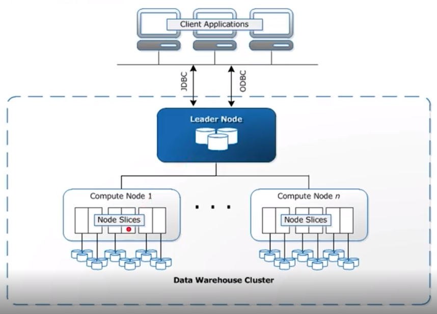

## AWS  
**Things to remember**  
1. Have to change the region in AWS console to see the cluster. Thats a bit of AWS mess up, i would say as it doesn't work like that in GCP.  

2. Recommended to copy the Access key ID & Secret access key from the console rather than copying it from .csv file. 

#### Infrastructure as a Code
1. aws-cli  
2. AWS sdk (supports lots of programming language like python & nodejs) aka boto3  
3. Amazon Cloud Formation (JSON description file called as stack)  

#### Creating AWS User
1. IAM
2. Click Users
3. Click Add Users
4. Fill Username, check Programatic Access
5. Click Attach existing policies directly and select AdministratorAccess
6. Click Next:Tags, Next, Create User
7. Copy Access key id, Secret Access key (this should not be shared publicaly)

When copied from credentials.csv got the below error when i ran the code.   
```
An error occurred (SignatureDoesNotMatch) when calling the ListObjects operation: The request signature we calculated does not match the signature you provided. Check your key and signing method.
```
**Resolution** : Copy it from the console, even if it looks same and reload the dwh.cfg file.  
```
User : L3Exercise2User
Access key ID : Access key ID
Secret access key : Secret access key
```
  
## Redshift
1. Column-storage : Can be used calculating values in a column of very big table.  
2. Massively Parallel Processing(MPP) databases parallelize the execution of one query on multiple CPUs/Machines. 
3. 

Redshift is a cluster, it has two types of nodes,
1. **Leader Node** : 
    * Coordinates compute notes
    * Handles external communication
    * optimizes query execution
2. **Compute Node** :  
    * Each with own CPU, memory and Disk
    * Scale Up : Get more powerful nodes
    * Scale Out: Get more nodes



### Node Slices 
Each compute node is logically divided into a number of slices. A cluster with n slices, can process n partitions of a tables simultaneously.  
**i.e.,** A Slice is a CPU and each CPU has disk associated to it.

There are two ways to work with Redshift or AWS products,
1. Click & Fill
2. Code Way

### Optimizing Table Design  
If one has an idea about the frequency of access pattern of a table, it will be easy to design for performance.  
1. Distribution Style *(specified at the end of table definition)*
2. Sorting Key - Useful for columns that userd frequently in sorting like the date dimension and its corresponding foregin key in the fact table. *( Specified at table definition on the specific column)*

### Distribution Styles
**Distribution Style : EVEN**  
Spreading rows even rows to all slices in a round-robin fashion for load-balancing. High cost for joins.  

**Distribution Style : ALL**  
Small tables are replicated to all slices to speed up joins. Used frequently for dimension tables. Broadcasting is the different name for ALL distribution style.  

**Distribution Style : AUTO**  
Leaves decision to Redshift. "Small enough" tables are distributed with an ALL strategy. "Large" tables are distributed with EVEN strategy

**Distribution Style : KEY**  
Rows having similar values are placed in same slice. Very useful when a dimension table is too big to be distributed with ALL strategy. In that case, we distribute both the fact table and dimension table using the same dist key. If two tables are distributed on the joining keys, redshift co-locates the rows from both tables on the same slices. 

```
Create table lineorder(
.
.
lo_partkey integer not null distkey
.
.)

create table part(
p_partkey interger not null distkey,
..
)
```

### Sorting Key
Data is sorted before loading into slices. Useful for columns that used frequently in sorting like the date dimension and its corresponding foregin key in the fact table.
```
Create table lineorder(
.
.
lo_partkey integer not null sortkey
.
.)

create table part(
p_partkey interger not null sortkey,
..
)diststyle all;
```

> distkey is usually set on large tables, suppose PART table is a big dimension table. Set part_key in PART table pkkey on distkey & LINEORDER(fact table) put distkey on part_key in LINEORDER table.

### Ingesting at scale
1. Use COPY command to transfer data from S3 Staging to Redshift as INSERT statement is slow
2. Better to break a single file to multiple files to take advantage of parallelism.(Use common prefix or manifest file)
3. Have S3 & Redshift in the same region

```
COPY sporting_event_ticket FROM 's3://udacity-labs/tickets/split/part'
CREDENTIALS 'aws_iam_role=arn:aws:iam::464956546:role/dwhRole'
gzip DELIMITER ':' REGION 'us-west-2';
```

```
s3.ObjectSummary(bucket_name='udacity-labs', key='tickets/split/part-00000.csv.gz')
```

**Using manifest file**
```
{
 "entries":[
    {"url":"s3://mybucket-alpha/2013-10-04-custdata", "mandatory":true},
    {"url":"s3://mybucket-alpha/2013-10-05-custdata", "mandatory":true}
 ]
}
```

```
COPY customer
FROM 's3://mybucket/cust.manifest'
IAM_ROLE 'arn:aws:iam::464956546:role/dwhRole'
manifest;
```

COPY command makes automatic best-effort compression decisions for each column

### ETL out of Redshift
```
UNLOAD ('select * from venue limit 10')
to 's3://mybucket/venue_pipe_'
iam_role 'arn:aws:iam::464956546:role/MyRedshiftRole';
```
