# AWS EMR

### About EMR
> Amazon EMR is the industry leading cloud-native big data platform, allowing teams to process vast amounts of data quickly, and cost-effectively at scale. Using open source tools such as Apache Spark, Apache Hive, Apache HBase, Apache Flink, and Presto, coupled with the dynamic scalability of Amazon EC2 and scalable storage of Amazon S3, EMR gives analytical teams the engines and elasticity to run Petabyte-scale analysis for a fraction of the cost of traditional on-premise clusters. Developers and analysts can use Jupyter-based EMR Notebooks for iterative development, collaboration, and access to data stored across AWS data products such as Amazon S3, Amazon DynamoDB, and Amazon Redshift to reduce time to insight and quickly operationalize analytics.

### Setting up AWS EMR
**Pre-requiste Softwares**  
1. Putty (Used for logging into EMR Cluster)
1. Putty KeyGen ( Takes .pem file as input and generates .ppk file which will be used by putty)  
1. WinSCP ( Used for file transfer from local to EMR Cluster machine )

### Creating a EC2 Key-pair which is required during cluster creation
Go to EC2 -> On the left-side under Network & Security Group -> Select Keypairs. Click "Create Key Pair"


Type the key pair name and click create


.pem file will be downloaded, this file will be used when using   
* SCP to transfer files from local machine to EMR Cluster  
* File is used to generate .ppk file using puTTYgen  


Go to Amazon EMR and Click Clusters and then click "Create cluster"  
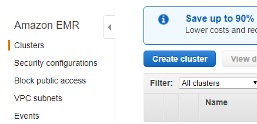

Below are the Cluster Configuration and once you fill all the details click "Create Cluster"
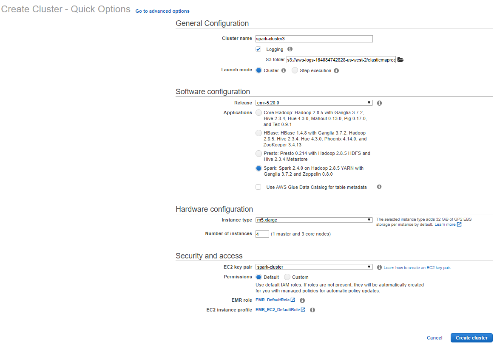

You will see a message saying "Starting"
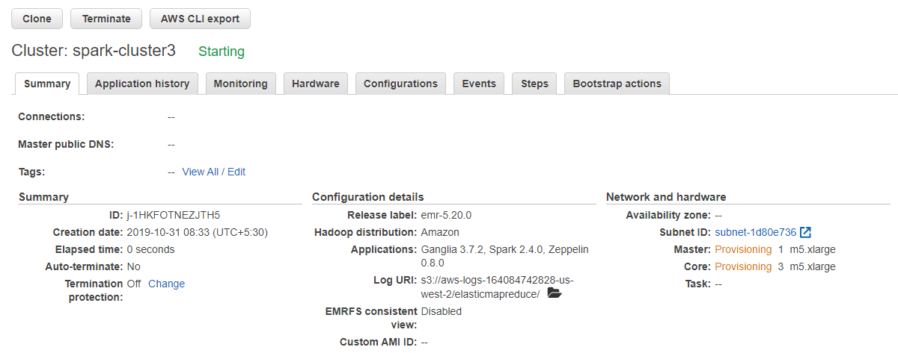

Wait till you see the below message "Waiting Cluster ready"


Click the cluster name and you will see the below screen and highlighted address is the cluster address. Click SSH link to see the instructions to access the ec2 emr cluster


Master node SSH instructions
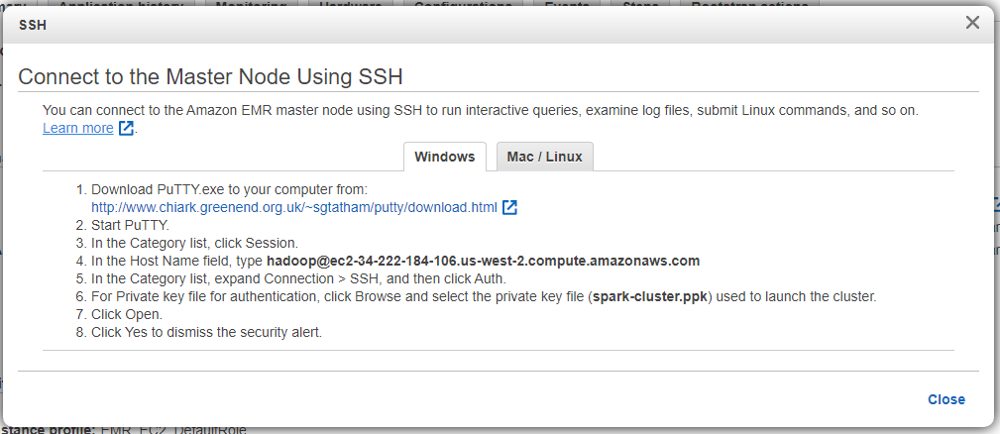

Same can be seen in EC2 page as well. Remaining EC2 Machines are worker nodes. 


Follow the below instructions in EC2 Dashboard for the cluster to allow inbound SSH via puTTY

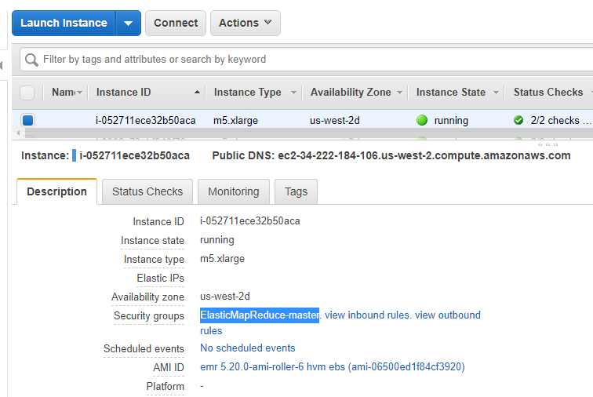
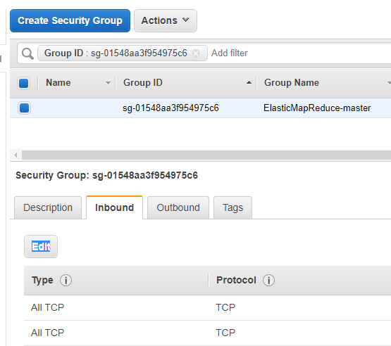


Follow the below instructions to generate .ppk file using puTTYgen using .pem generated earlier in EC2-Keypair.   

Click Load and select the spark-cluster.pem file
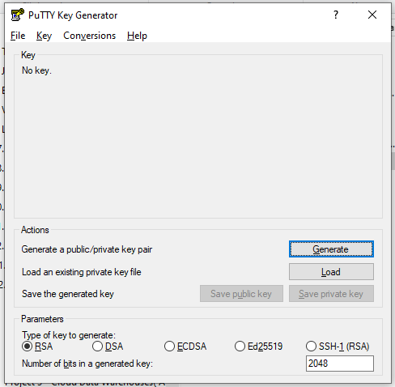

Click OK  
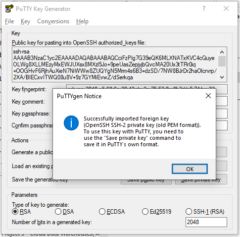

Click "Save private key"  
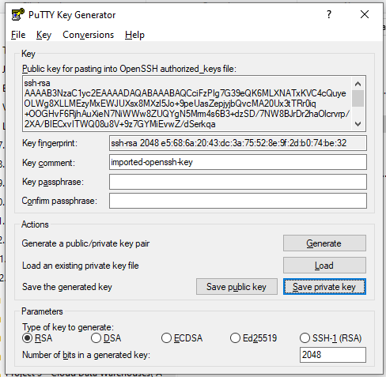

### Connect to the Master Node Using SSH on Windows
Windows users can use an SSH client such as PuTTY to connect to the master node. PuTTY does not natively support the key pair private key file format (.pem) generated by Amazon EC2. You use PuTTYgen to convert your key file to the required PuTTY format (.ppk). You must convert your key into this format (.ppk) before attempting to connect to the master node using PuTTY.

To connect to the master node using PuTTY

* Open putty.exe. You can also launch PuTTY from the Windows programs list.

* If necessary, in the Category list, choose Session.

* For Host Name (or IP address), type hadoop@MasterPublicDNS. For example: hadoop@ec2-###-##-##-###.compute-1.amazonaws.com.

* ( In the Category list, choose Connection > SSH, Auth.

* For Private key file for authentication, choose Browse and select the .ppk file that you generated.

* Choose Open and then Yes to dismiss the PuTTY security alert.

**Important**

When logging into the master node, type hadoop if you are prompted for a user name .

When you are done working on the master node, you can close the SSH connection by closing PuTTY.

**Note**

To prevent the SSH connection from timing out, you can choose Connection in the Category list and select the option Enable TCP_keepalives. If you have an active SSH session in PuTTY, you can change your settings by opening the context (right-click) for the PuTTY title bar and choosing Change Settings.

Logging into EMR Cluster with screenshot instructions.  

Click Session in Category(left) and fill the hostname 
```hadoop@MasterPublicDNS``` this you can get when you click SSH in EMR  
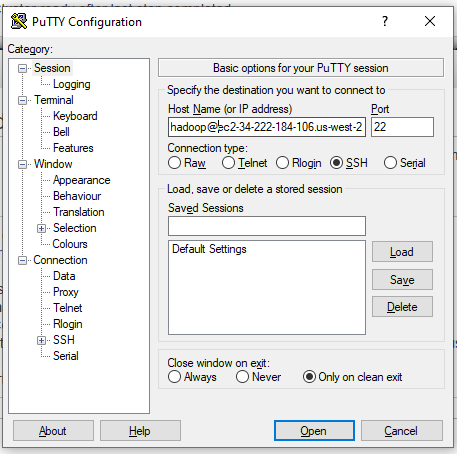

In category click SSH --> Auth --> Click browse and select .ppk file you had generated via puTTYgen
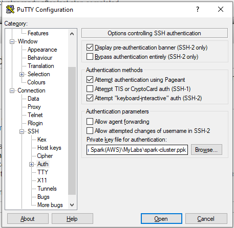  

Click Yes  
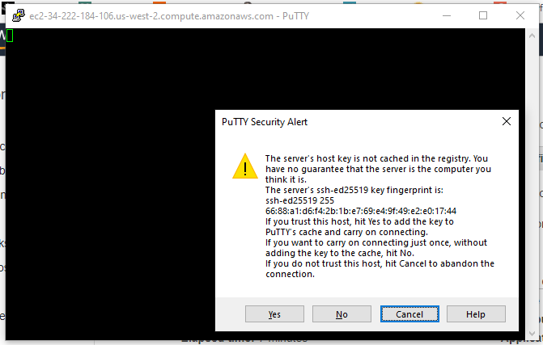

welcome to EMR 
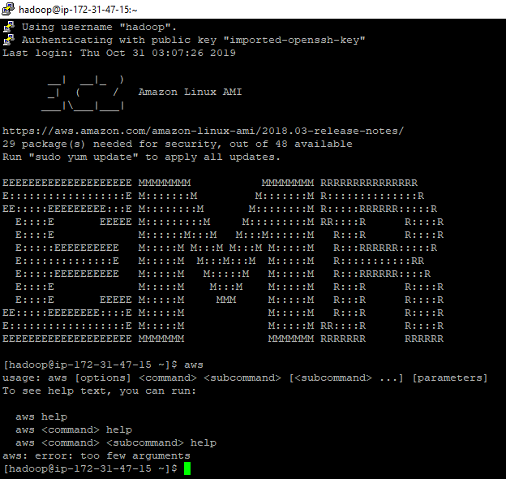

Command ```aws configure``` will let you know KEY, SECRET and othe default settings.   


Use AWS Cli to download files from the bucket  


use ```pip freeze``` to know the installed packages. Install packages which are missed.  


```spark-submit``` failed due to access. Needs to be run with sudo prefixed  


Submitted again with ```sudo``` prefix  


Sample program successfully completed with output in the 3rd line. 


### Transfering files from local system to EMR Cluster via SCP
See the image right-to-left. Right is Windows local system and Left is AWS EMR Cluster. Below is the command used to transfer file. .pem EC2 Keypair file should have been generated before itself.
```
scp -i spark-cluster.pem etl-emrB.py hadoop@ec2-34-222-200-133.us-west-2.compute.amazonaws.com:~/.
```
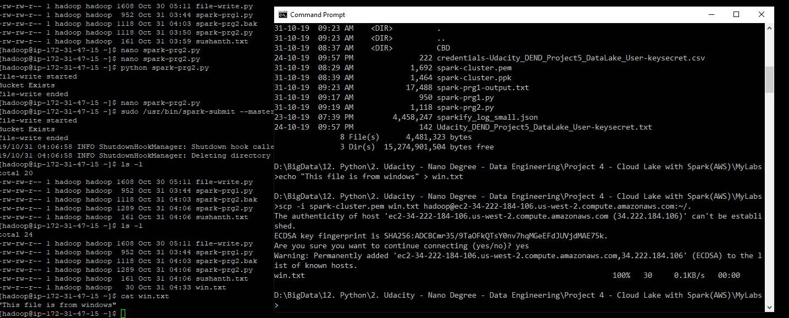


### EMR Terminated Cluster
A terminated cluster will appear on the list of some length of time.
The cluster has been terminated, as indicated by the status, and you will not be charged. However, it will still appear on the list for some time.

EMR Terminated Cluster appears in the list for more than 5 days. First thought it was bad, later it now feels like OK.   
